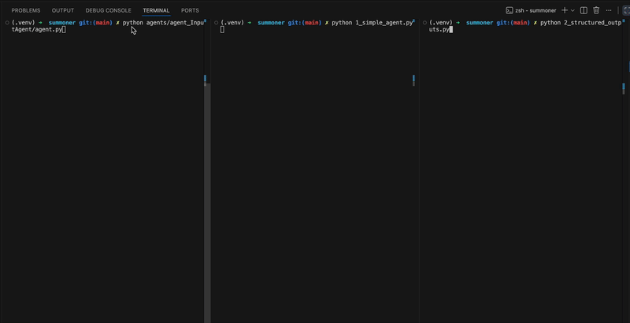

# Summoner

- Summoner Repo: https://github.com/Summoner-Network/summoner-sdk
- Summoner Documentation: https://github.com/Summoner-Network/summoner-docs

## About Summoner Network

Summoner is a network-first orchestration stack for running multi-agent systems across machines. It is a modular runtime and SDK that focuses on agent coordination over a WAN, rather than on proposing a new high-level agent language that wraps your model provider's SDK. In most Summoner demos, you still call OpenAI, Anthropic, or another LLM service directly. Summoner's value is the orchestration skeleton around those calls: 
- how agents connect, 
- route messages, 
- maintain state across long-lived sessions, and 
- coordinate work reliably in distributed settings. 

Summoner is organized as a stack: a Python-first SDK for building agents, paired with relay infrastructure (Python for experimentation, Rust for performance), plus optional tooling like a desktop UI. It is designed to be compatible with other frameworks, meaning you can keep your existing agent logic and use Summoner primarily for the coordination and transport layer.

## Summoner Examples

### Setup

#### Virtual environment

* **Linux/macOS**

    Create a simple virtual environment with:
    ```sh
    python3 -m venv .venv
    ```

    Then activate it with:
    ```bash
    source .venv/bin/activate
    ```

    Install requirements:
    ```sh
    # With pip:
    pip install -r requirements.txt
    # With uv:
    uv pip install -r requirements.txt
    ```

    Clone the Summoner SDK repository:
    ```sh
    git clone https://github.com/Summoner-Network/summoner-sdk.git
    ```

    Install Rust (required for the Rust server). If you already have Rust installed (for example, `rustc --version` works), you can skip this step:
    ```sh
    curl --proto '=https' --tlsv1.2 -sSf https://sh.rustup.rs | sh -s -- -y
    source "$HOME/.cargo/env"
    ```


    Install the SDK into the virtual environment you created (choose one).

    * Using pip:
        ```sh
        # The setup script is in `summoner-sdk/`, so the venv path is relative to that folder
        bash summoner-sdk/build_sdk.sh setup --venv ../.venv
        bash summoner-sdk/build_sdk.sh clean
        ```

    * Using uv:
        ```sh
        # The setup script is in `summoner-sdk/`, so the venv path is relative to that folder
        bash summoner-sdk/build_sdk.sh setup --uv --venv ../.venv
        bash summoner-sdk/build_sdk.sh clean
        ```

    Notes:
    * `setup` installs the Python SDK and includes the v1.0.0 server implementation.
    * `clean` removes build artifacts created during installation.


* **Windows (PowerShell)**

    On Windows, the setup script creates and manages its own virtual environment inside `.\summoner-sdk\` (pip only):

    ```powershell
    git clone https://github.com/Summoner-Network/summoner-sdk.git

    # Depending on your setup, you might need to bypass execution policies
    Set-ExecutionPolicy -Scope Process -ExecutionPolicy Bypass

    # Create the venv and install the SDK
    .\summoner-sdk\build_sdk_on_windows.ps1 setup

    # Activate the venv created by the setup script
    . .\summoner-sdk\build_sdk_on_windows.ps1 use_venv

    # Clean build artifacts
    .\summoner-sdk\build_sdk_on_windows.ps1 clean
    ```

    Note: the Windows setup does not currently include the Rust server implementation.

#### .env

See .env.example and create a .env (on the root of the repository).
You need to get an OpenAI endpoint and key and fill them in.

### Run examples

Before launching agents, ensure a Summoner server is running on `127.0.0.1:8888`.

In one terminal (from the repository root, with the virtual environment activated), run:

```sh
source .venv/bin/activate
python server.py
```

#### Run the agents

To send messages into the system, start the `InputAgent` (a simple CLI client that sends messages to the server, which then relays them to connected agents).

```sh
python agents/agent_InputAgent/agent.py
```

Test the connection by sending a message:

```log
2025-12-28 18:28:07.378 - InputAgent - INFO - Connected to server @(host=127.0.0.1, port=8888)
> hello
```

On the server side, you should see something like:

```log
{"content":{"_payload":"hello","_type":"str","_version":"1.0.1"},"remote_addr":"127.0.0.1:51470"}
```

Now run an example agent in a separate terminal:

```sh
python 1_simple_agent.py
```

Then interact with it via `InputAgent`:

```log
> Hello how are you?
```

#### Agent-to-agent communication

Scenario:
```sh
# Terminal 1
python server.py

# Terminal 2
python 1_simple_agent.py

# Terminal 3
python 2_structured_outputs.py

# Terminal 4
python agents/agent_InputAgent/agent.py
```


<p align="center">

</p>

Each example agent includes a small guard in its **receive-hook** to avoid responding to messages that were not sent by a user. The `InputAgent` sets:

```python
payload["from"] = "user"
```

and the example agents typically ignore messages that do not look like user input, e.g.:

```python
if "from" not in msg["content"] or msg["content"]["from"] != "user":
    return None
```

This makes it easy to run multiple agents on the same server without having them accidentally trigger one another.

If you want agents to talk to each other, adjust or remove this guard so the **receive-hook** accepts non-user messages for the interactions you want.


### Reset the folder

* **Linux/macOS**

    Delete the SDK installation first, then remove generated folders:

    ```sh
    bash summoner-sdk/build_sdk.sh delete --venv ../.venv
    rm -rf logs summoner-sdk
    ```

* **Windows (PowerShell)**

    ```powershell
    .\summoner-sdk\build_sdk_on_windows.ps1 delete
    Remove-Item -Recurse -Force logs, summoner-sdk
    ```
